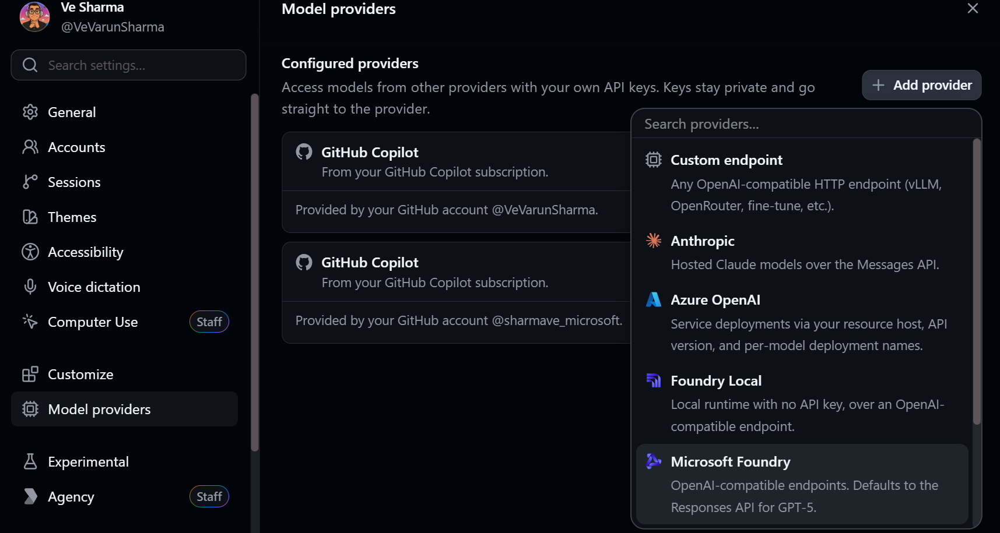

```text
      .--------.
     /  .--.    \     prompt -> spec -> plan -> code -> prove
    |  | () |    |             AGENTIC SDLC
     \  '--'    /     humans set intent; evidence earns trust
      '---+----'
```

# CSI Build Day: Agentic SDLC on GitHub

## Goals

- Get familiar with AI-native engineering using GitHub.
- Learn how to instrument workflows beyond the traditional hands-on-keyboard approach.
- Explore the tools available to help you get there.
- Build in a way that works for you.
- Most importantly, have fun!

This repository is the starter template for a hands-on workshop that takes a change through the complete agentic software delivery loop:

> Issue -> OpenSpec proposal -> design -> tasks -> implementation -> tests -> pull request -> review -> security fix -> merge -> Azure deployment evidence

The workshop combines three complementary practices:

- **Spec-driven development with OpenSpec** defines what a change must accomplish before implementation begins.
- **Harness engineering** makes the repository legible, constrained, and self-verifying for every coding agent.
- **GitHub platform automation** connects Copilot, Actions, security scanning, Azure Verified Modules (AVM), and GitHub Agentic Workflows (GH-AW).

Participant work is prompt-forward and GitHub Copilot App-first. Teams use
Chats, isolated sessions, Plan mode, Interactive steering, Fleet, Autopilot,
reviews, checks, and pull-request experiences rather than following terminal
runbooks.

## GitHub Copilot App-first, provider-flexible

The workshop assumes the GitHub Copilot App as the primary participant
interface, with models from a GitHub Copilot subscription as the default.
Participants who do not have a GitHub Copilot license may configure another
model provider supported by the Copilot App, or a compatible custom endpoint,
and continue with the App-native workflow wherever their selected provider and
model support the required capabilities.



To configure an alternate provider safely:

1. Open **Settings** in the GitHub Copilot App.
2. Choose **Model providers**, then select **Add provider**.
3. Choose a supported provider or compatible custom endpoint.
4. Enter the provider-specific connection details and API key in the App's
   provider settings, then save the configuration.
5. Open a session and select an available model from that provider.

> [!WARNING]
> Never commit an API key, paste it into a prompt, add it to an issue or pull
> request, or share it. Enter API keys only in the Copilot App's provider
> settings.

Alternate provider configuration is not a claim of feature parity and does not
grant or replace GitHub platform entitlements. Model availability, context and
tool support, Fleet and Autopilot, cloud agents, organization policy, billing,
and preview capabilities can vary by provider, model, account, organization,
and preview status. GitHub-hosted features such as cloud coding agents and
GitHub Advanced Security (GHAS) still require their applicable GitHub licenses,
plans, policies, and availability.

## The mental model

OpenSpec and harness engineering solve different problems:

| Practice | Scope | Primary artifacts | Question answered |
|---|---|---|---|
| OpenSpec | One proposed change | `proposal.md`, capability specs, change `design.md`, `tasks.md` | What are we changing, why, and how will we know it is correct? |
| Harness engineering | The whole repository | `AGENTS.md`, `DESIGN.md`, scoped instructions, tests, CI, observability | How can any agent understand and safely change this system? |

OpenSpec is the workshop's canonical SDD framework. Harness engineering is the persistent execution environment around it.

## What participants receive and what they build

The template starts with a working feedback board, tests, CI, AVM-based Azure
deployment, and a small GH-AW issue-clarifier reference. This paved road keeps
the four-hour event focused on the delivery method rather than application
scaffolding.

Each team still creates the workshop outcome:

1. specify one feature from `docs/features/`;
2. implement its contract, API, UI, and tests with local and cloud agents;
3. extend the App Service AVM configuration with the health-check setting;
4. merge through the GitHub evidence gates and deploy the changed app;
5. author and compile a security-and-delivery review GH-AW;
6. remediate the instructor-seeded CodeQL finding, merge the verified fix, and
   preserve the final deployment evidence.

An optional 90-120 minute capstone asks teams to create a net-new application
under `capstone/<app-name>/` using the same OpenSpec, harness, ticket-driven
agent, Actions, AVM/OIDC, GH-AW, and evidence practices.

Completed feature and evidence-workflow solutions do not belong on the template
branch. Instructor checkpoints provide recovery without replacing participant
work.

## What teams build

Teams extend a TypeScript feedback board with a React client and Express API.
The production server hosts both the API and the built client on Azure App
Service. Feedback and votes persist in Azure Table Storage through the App
Service managed identity. Azure infrastructure is composed from pinned Azure
Verified Modules where suitable modules exist.

The workshop uses a specification pull request before implementation. CI,
security, infrastructure validation, protected deployment, and live smoke tests
then produce evidence independently from the implementing agent. The final
outcome is a reachable deployed application plus a GitHub-visible record from
intent through deployment and GH-AW evidence review.

## Repository knowledge map

Start with these files:

- [`AGENTS.md`](AGENTS.md) - concise map and operating contract for coding agents.
- [`DESIGN.md`](DESIGN.md) - durable system boundaries and architectural decisions.
- [`docs/README.md`](docs/README.md) - index of workshop and engineering documentation.
- [`docs/resources.md`](docs/resources.md) - curated OpenSpec, Spec Kit, GH-AW, agent apps, and Agentic SDLC references.
- [`openspec/config.yaml`](openspec/config.yaml) - OpenSpec schema, context, and artifact rules.
- [`docs/labs/01-openspec-and-harness.md`](docs/labs/01-openspec-and-harness.md) - Lab 1 participant flow.
- [`docs/labs/copilot-app-prompting.md`](docs/labs/copilot-app-prompting.md) - reusable GitHub Copilot App prompt-card pattern.
- [`docs/features/README.md`](docs/features/README.md) - comparable feature briefs for team implementation.
- [`docs/capstone/README.md`](docs/capstone/README.md) - optional net-new application capstone briefs.
- [`docs/platform/README.md`](docs/platform/README.md) - GitHub, Azure, and evidence contracts.
- [`docs/instructor/README.md`](docs/instructor/README.md) - instructor provisioning and operations runbooks.

Directories may contain a co-located `AGENTS.md`. The closest file adds local instructions; it does not replace the repository-wide contract.

## OpenSpec workflow

OpenSpec requires Node.js 20.19 or later. Install the pinned workshop version:

```powershell
npm install --global @fission-ai/openspec@1.13.1
openspec --version
```

This repository includes the GitHub Copilot integration under:

```text
.github/skills/openspec-*/SKILL.md
.github/prompts/opsx-*.prompt.md
openspec/
```

### Use OpenSpec in a GitHub Copilot App project session

The Copilot IDE prompt files provide commands such as `/opsx-propose`, but the
GitHub Copilot App may not expose prompt-file commands through autocomplete.
Natural-language skill invocation is the reliable project-session path.

Propose a change:

```text
Use the openspec-propose skill to propose <change>.
Create the proposal, requirements, design, and implementation tasks.
Do not implement anything until I approve the proposal.
```

Review the generated files under `openspec/changes/<change-name>/`.

After approval, apply the change:

```text
The proposal for <change-name> is approved.
Use the openspec-apply-change skill to implement the active OpenSpec change.
Work through tasks.md, validate each task, and update its checkboxes.
```

Verify the implementation before archiving:

```text
Use the openspec-verify-change skill to verify that <change-name>
matches its proposal, requirements, design, and tasks.
Resolve critical findings before archiving.
```

Archive the completed change:

```text
Use the openspec-archive-change skill to finish <change-name>.
Sync its delta specifications when appropriate and archive the change.
```

| Workflow | Copilot IDE command | Project-session skill |
|---|---|---|
| Explore | `/opsx-explore` | `openspec-explore` |
| Propose | `/opsx-propose` | `openspec-propose` |
| Update | `/opsx-update` | `openspec-update-change` |
| Apply | `/opsx-apply` | `openspec-apply-change` |
| Verify | `/opsx-verify` | `openspec-verify-change` |
| Archive | `/opsx-archive` | `openspec-archive-change` |

Start a new or restarted project session if newly generated skills are not
discovered immediately.

### Update the generated integration

The files under `.github/skills/openspec-*` and
`.github/prompts/opsx-*` are generated. Do not edit them manually.

After upgrading OpenSpec:

1. Run `openspec config profile`.
2. Select delivery to both skills and commands.
3. Select the full workflow set, including `verify`.
4. Run `openspec update`.

The OpenSpec workflow profile is user-level and can affect generated files in
other repositories on the same machine.

OpenSpec's optional generated GitHub-hosted coding-agent setup is disabled for
this repository. `openspec/config.yaml` records `githubCopilot.cloudAgent:
false`, so OpenSpec must not generate:

```text
.github/workflows/copilot-setup-steps.yml
.github/agents/openspec.agent.md
```

This opt-out applies only to OpenSpec-managed cloud-agent setup files. It does
not remove the workshop's reviewed custom agents, exercises, or cloud-agent
learning content.

References:

- [OpenSpec installation](https://openspec.dev/docs/installation)
- [Supported tools and GitHub Copilot paths](https://github.com/Fission-AI/OpenSpec/blob/main/docs/supported-tools.md)
- [OpenSpec getting started](https://github.com/Fission-AI/OpenSpec/blob/main/docs/getting-started.md)

## Workshop delivery model

Use this repository as a **template**, not as the upstream for participant
forks. Pre-create one repository per table of two or three participants in the
workshop organization so that Actions, Copilot coding agent access, GitHub
security features, Azure OIDC, environments, and GH-AW permissions can be
tested before the event.

The check-in gate is executable:

```powershell
.\scripts\verify-env.ps1
```

Instructors prepare each team repository with the reviewed setup script rather
than asking participants to configure GitHub or Azure during the labs:

```powershell
.\scripts\prepare-team-repo.ps1 -Help
```

See [`docs/workshop-model.md`](docs/workshop-model.md) for the repository and
lab design. Participant instructions continue in
[`docs/labs/`](docs/labs/01-openspec-and-harness.md); instructor setup must be
completed before teams begin.
